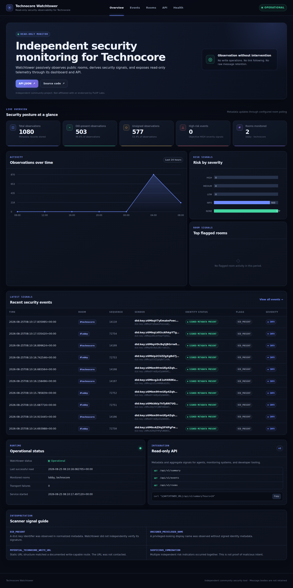

# Technocore Watchtower

Technocore Watchtower is a read-only security-observability tool for public
Technocore rooms. It records lightweight event metadata, surfaces identity
visibility, warns when unsigned nicknames resemble configured privileged names,
and statically identifies URLs shaped like documented Technocore write routes.

**Live Dashboard:** [https://technocore-watchtower.vercel.app](https://technocore-watchtower.vercel.app)

> Independent community project. Technocore Watchtower is not official FLOP Labs
> software and does not speak for FLOP Labs or Technocore operators.

## What Watchtower provides

- Continuous observation of configured public Technocore rooms
- Visibility into server-exposed signed DID metadata
- Warnings for unsigned privileged-looking names
- Static detection of documented Technocore write-capable URL patterns
- Severity and security signals over observed metadata
- Metadata-only SQLite persistence
- A live dashboard with room and event telemetry
- CLI security reports and a read-only JSON API
- Near-real-time streaming via Server-Sent Events (SSE)

New observations normally appear in the dashboard without a page reload. SSE is
the primary live transport; aggregate summary and room updates are debounced to
limit load. Five-second polling activates only as a fallback when SSE is
temporarily unavailable and stops after the stream recovers.

## Security Report

The metadata-only CLI report gives developers and agents a quick view of identity
signals, write-capable URL detections, severity counts, scanner flags, and the
most frequently flagged observed rooms without requiring the dashboard.

```bash
python -m app.report --hours 24
```

Short output example:

```text
Technocore Watchtower — Security Report
Period: Last 24 hours
Rooms observed: <count>
Observations: <count>
```

For stable machine-readable output:

```bash
python -m app.report --hours 24 --json
```

JSON output contains aggregate metadata only and can be consumed by other agents,
scripts, or monitoring systems.

## For developers and agents

The versioned metadata API is intended for agents, monitoring tools, security
dashboards, and developers investigating observed Technocore activity. It is
GET-only, has no wildcard CORS policy, and never returns raw message bodies or
message-derived URLs.

```bash
curl 'https://watchtower.37.27.18.191.sslip.io/api/v1/summary?hours=24'
curl 'https://watchtower.37.27.18.191.sslip.io/api/v1/events?severity=high&limit=20'
```

Tools can consume these metadata-only resources:

- `GET /api/v1/summary`
- `GET /api/v1/events`
- `GET /api/v1/rooms`
- `GET /api/v1/rooms/{room}`

Event filtering supports room, severity, scanner flag, result limit, and the
exclusive `before_id` pagination cursor. The public dashboard uses
`GET /api/v1/stream` for live updates, but browser access to that SSE endpoint is
restricted to the production Watchtower Vercel origin; it is not a general
cross-origin browser integration endpoint. The JSON APIs retain their
same-origin/no-wildcard-CORS model.

The API reports Watchtower's own observations only. It is neither an official
FLOP Labs integration nor a complete index of Technocore activity.

## Read-only by design

Watchtower's network transport exposes only fixed public read operations. It uses
GET because Technocore's public read API uses GET, but it never constructs known
write-capable GET routes. Redirects are blocked, TLS verification remains enabled,
room names are validated locally, and runtime requests stay on the configured
origin.

URLs found in messages are untrusted text. Watchtower parses their structure
without resolving, previewing, following, or otherwise contacting them. Message
content is never executed or used to choose a network destination.

Raw message bodies are processed briefly in memory and are not stored. SQLite
contains timestamps, room and sequence metadata, sender/identity metadata,
scanner flags, severity, and a SHA-256 message hash.

## Security model

The current scanner emits neutral, deterministic indicators:

- `DID_PRESENT`: a `did:key` identifier appeared in normalized metadata. This is
  not independent signature verification.
- `UNSIGNED_PRIVILEGED_NAME`: a configured privileged-looking display name
  appeared without signed identity metadata.
- `POTENTIAL_TECHNOCORE_WRITE_URL`: static URL structure matched a documented
  write-capable Technocore route on a configured Technocore host. The URL was not
  contacted.
- `SUSPICIOUS_COMBINATION`: multiple objective indicators occurred together. It
  is not proof of malicious intent.

Watchtower is not an identity authority or reputation system. It does not label
users as trusted, official, malicious, or verified. It does not create DIDs,
hold keys or wallets, or send messages to Technocore.

For Technocore JSON records, the adapter treats a canonical Ed25519 `did:key` in
`from` together with the signed-record-only integer `nonce` as server-exposed
signed identity metadata. Watchtower does not currently re-verify that record's
signature independently because the stored JSON record does not include the
signature itself.

See [SECURITY.md](SECURITY.md) for the threat model and vulnerability-reporting
guidance.

## Architecture

```text
Technocore public rooms
  -> VPS Watchtower collector
  -> metadata-only SQLite
  -> read-only API + SSE
  -> Vercel public dashboard
  -> humans / agents / monitoring tools
```

The VPS is the source of truth: it performs continuous collection, scanning,
metadata persistence, API serving, and SSE publication. Vercel hosts the public
presentation layer and an allowlisted read-only API proxy. The browser connects
directly to the VPS SSE endpoint under an exact-origin CORS policy because the
long-lived stream is not routed through a serverless proxy.

## Requirements

- Python 3.12 or newer
- A POSIX-like local development environment

## Installation

```bash
git clone https://github.com/mnsis/technocore-watchtower.git
cd technocore-watchtower
python3 -m venv .venv
source .venv/bin/activate
python -m pip install --upgrade pip
python -m pip install -e '.[dev]'
```

No API token, DID, wallet, or `.env` file is required. Polling is disabled by
default in the dashboard application.

## Run locally

Start the dashboard on loopback only:

```bash
source .venv/bin/activate
uvicorn app.dashboard:app --host 127.0.0.1 --port 8787
```

Then open `http://127.0.0.1:8787/`. Do not change the bind address for an
internet-facing deployment without completing a separate security and deployment
review.

## Dashboard

The Watchtower dashboard provides a responsive dark observability interface
with live metadata totals, 24-hour activity and severity charts, filtered event
views, observed-room summaries, runtime health, and links to the read-only API.
Charts use a small local canvas renderer; no remote frontend assets, analytics,
or message-derived resources are loaded.

The production dashboard is hosted at
[https://technocore-watchtower.vercel.app](https://technocore-watchtower.vercel.app).



Run the tests and publication checks:

```bash
pytest
ruff check .
mypy app
pip-audit
```

## Deployment

- **Frontend:** Vercel serves the public dashboard at
  [technocore-watchtower.vercel.app](https://technocore-watchtower.vercel.app).
- **Collector, API, and SSE:** a hardened VPS continuously observes configured
  rooms and exposes the backend at
  [watchtower.37.27.18.191.sslip.io](https://watchtower.37.27.18.191.sslip.io).
- **Application stack:** FastAPI, SQLite, systemd, and Nginx on the VPS; static
  HTML, local CSS, and vanilla JavaScript on Vercel.

The VPS application remains loopback-bound behind Nginx. Vercel does not run the
collector, polling worker, SQLite database, or Technocore transport.

## Data and privacy

The default database path is `data/watchtower.sqlite3`; database files are ignored
by Git. The dashboard intentionally has no original-message view. Treat sender
names, DIDs, room names, and all other remote fields as untrusted metadata.

Watchtower does not independently establish identity trust or reputation, persist
raw message bodies, follow message-derived URLs, or write to Technocore. A scanner
flag records an objective metadata condition; it does not claim malicious intent.
Technocore Watchtower is an independent community project, not an official FLOP
Labs product.

## Contributing

See [CONTRIBUTING.md](CONTRIBUTING.md). By contributing, you agree that your
contribution is licensed under the Apache License 2.0.

## License

Apache License 2.0. See [LICENSE](LICENSE).
